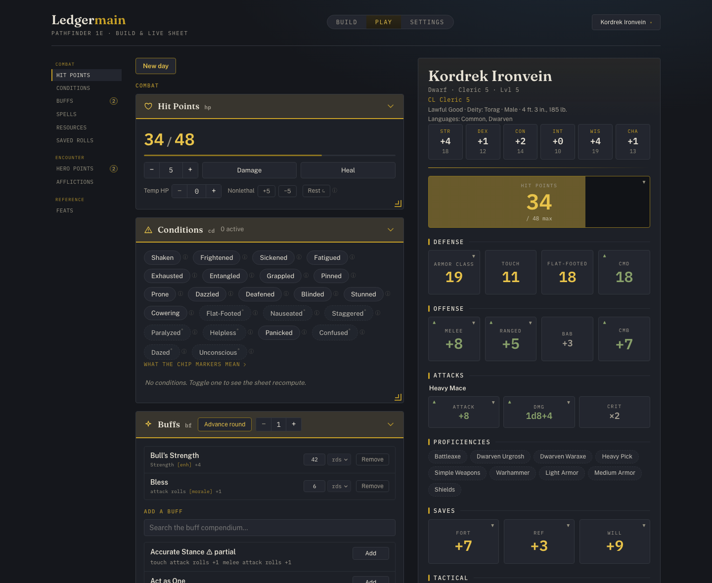
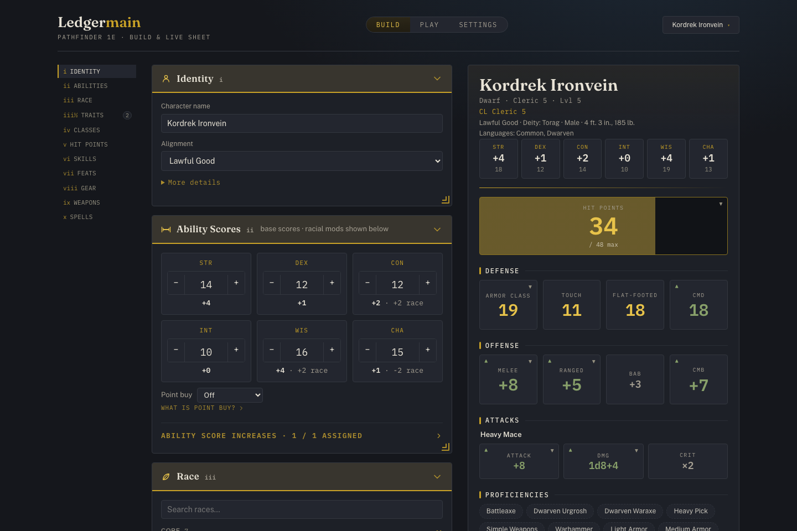

# Ledgermain

**A rules-aware, in-play character sheet, tracker, and builder for Pathfinder 1e.**

Live at **[ledgermain.whizkid.dev](https://ledgermain.whizkid.dev)**

Ledgermain focuses on **play**. It's a tracker that knows the rules well enough to recompute the correct numbers as your session state changes: take damage, fail a save, toggle a buff, spend a resource, gain a condition: every derived value (AC, attack lines, saves, skills, CMB/CMD, DCs) updates instantly and correctly. See [Comparison to other tools](#comparison-to-other-tools) for how it stacks up against PCGen, HeroLab, Pathbuilder, and Foundry.



_The live tracker — toggle a condition, tick a buff down, or take damage, and every derived number on the sheet recomputes._



_The builder — every choice updates the same sheet the same engine drives at the table._

## Why it's different

- **Tracker and builder, in one.** The live sheet is, well, live. Buffs have durations that tick down; conditions cascade into the numbers that depend on them; resources (spell slots, ki, rounds/day, charges) are tracked, wired up, and recover on rest.
- **It actually does the math.** An exhaustively-tested rules engine handles the two hard parts of _Mathfinder_: **typed bonus stacking** (highest-within-type, dodge/untyped stack, penalties always stack, with per-source provenance so overridden bonuses show struck through) and a **formula evaluator** all done live locally for speed.
- **Deliberately not a dice roller.** Ledgermain tells you what your modifiers _are_ and hands you clean, explained roll lines; it doesn't roll for you. It complements a physical table or a VTT rather than trying to replace them.
- **Offline-capable and private.** Your character lives in your browser (IndexedDB). Optional cloud sync is optional. The app never needs the network to compute anything. Don't trust us? Just run it locally and move your character around in json.

## Comparison to other tools

- **PCGen** — a desktop character builder in Java. It's a build-then-print tool: once you've generated the sheet, nothing recomputes as session state changes, because it isn't tracking session state at all.
- **HeroLab** — the closest thing to a real competitor in intent: it does try to track live session state (conditions, buffs, HP) rather than just building and printing a sheet. But it's expensive, clunky, and has weird edge cases for simple things.
- **Pathbuilder** — a fast, mobile-friendly builder popular for quick character creation and export. It doesn't track live session state: no condition toggles, no buff durations, no recompute once you leave the builder. And it's Android-exclusive.
- **Foundry VTT (PF1 system)** — arguably the most capable in-play PF1e sheet that exists, and the source Ledgermain's reference data is mined from. But it requires running the entire Foundry VTT — a license, a hosted or self-hosted server, typically a full virtual-tabletop session — even if all you want is a sheet for a physical table. Plus, it doesn't wire up a lot of things and leaves them just as plain text.

## Features

**Builder**

- Full from-scratch character creation: race, ability scores, class levels (multiclass supported), skills, feats, and gear.
- **All 44 classes** and their subsystems: bloodlines, arcane schools, domains, hexes, rage powers, alchemist discoveries, rogue talents, oracle revelations, kineticist elements/wild talents, summoner eidolons, spiritualist phantoms, occultist implements, medium spirits, and more.
- Archetypes, with their numeric effects applied where the data supports it.
- Hybrid prerequisite validation: hard-blocks only on _structured_ signals (ability minimums, BAB, caster level, required feats); prose-only prerequisites show a soft warning and never block.

**Tracker (at the table)**

- Live HP (including temp and nonlethal), conditions, and typed buffs with round-based durations.
- Resource pools that spend and recover: spell slots (prepared and spontaneous), ki, rounds/day, uses/day, item charges, hero points.
- Explained numbers: tap any derived value to see exactly which bonuses and penalties compose it.
- Saved rolls and a printable character sheet if you roll that way.

**Under the hood**

- Reference data (spells, feats, classes, items, buffs, …) mined from the Foundry VTT PF1 system and vendored as normalized JSON. The app builds and runs entirely offline from the vendored data.
- Optional cross-device sync via a thin Cloudflare Worker (Discord login); the server is dumb persistence and never computes game logic.

## Try it

The hosted instance is at **[ledgermain.whizkid.dev](https://ledgermain.whizkid.dev)**. No account needed — start building and your character autosaves locally in the browser.

## Run it locally

Toolchain is [**Bun**](https://bun.sh) (workspaces). No other runtime needed.

```bash
bun install
bun run dev          # → http://localhost:5173  (copies reference data, then starts Vite)
```

By default the app runs **local-only** (IndexedDB, no cloud sync) — leave `VITE_API_URL` unset. See [`apps/api/README.md`](./apps/api/README.md) to run the sync Worker.

## How it's built

Five Bun-workspace packages, one hard rule.

```text
packages/schema         shared types: CharacterDoc, DerivedSheet, RefData (the contracts everything imports)
packages/data-pipeline  pinned Foundry YAML → normalized JSON (vendored, committed)
packages/engine         pure rules engine — compute(doc, refData) → DerivedSheet (the crown jewel)
apps/web                React + Vite builder + live tracker
apps/api                Cloudflare Worker: opaque CharacterDoc persistence + cross-device sync
```

> **The client is authoritative for all game logic. The server is dumb persistence.**

Two objects drive everything: a serializable `CharacterDoc` (build choices + live session state, but _never_ derived values), and a pure `compute(doc, refData) → DerivedSheet` that returns every displayed number. Toggle anything in the doc → recompute. That single rule is why the builder and tracker share one brain, and why sync/offline are cheap.

Yes, this is built with heavy AI assistance. There's just too much data to munge otherwise. I've wanted to build
something like this for a long time, but it's only with AI assistance that it's become possible.

## Project status & scope

Ledgermain is a **single-player** PF1e sheet, and that's the intended end state. It is used and actively developed, but it is a personal project, not a commercial product.

**Deliberately out of scope** (so you know what _not_ to expect):

- **No dice roller** — it computes and explains modifiers; it doesn't roll.
- **No party / GM / real-time multiplayer.** The architecture keeps this cheap to add later, but it is not on the roadmap.
- A few rules subsystems aren't modeled yet (e.g. spell resistance, full encumbrance). The builder is honest about what it can't enforce rather than silently wrong.

Content breadth and known gaps are tracked in the [issue tracker](https://github.com/bjschafer/ledgermain/issues).

## Contributing

Contributions are welcome — bug reports, rules corrections, and PRs alike.

- **Prerequisites:** [Bun](https://bun.sh) (`1.3+`). Everything else installs with `bun install`.
- **The gates** (all must stay green; CI shape):

  ```bash
  bun run typecheck    # tsc --noEmit across all packages — the primary gate
  bun run lint         # oxlint (errors block; warnings tolerated)
  bun run fmt:check    # oxfmt --check
  bun run test         # unit tests (engine + data-pipeline + web)
  bun run e2e          # Playwright (Chromium); boots its own dev server
  ```

- **Where logic goes:** game logic is **pure and tested** — in `packages/engine` or `apps/web/src/model/`, never in React components (which are thin views). Add a fixture/model test with any behavior change.
- **Clean-room discipline (important):** the rules engine is a clean-room reimplementation from the published PF1 rules. Foundry's GPL-3.0 system _code_ may be used **only as a behavioral test oracle** — compare outputs, never copy, transcribe, or port. Do not paste upstream source into this repo. See [`NOTICE.md`](./NOTICE.md) §1.
- **Reference data** is vendored and pinned; never update it implicitly. To bump it, edit `FOUNDRY_SHA` / `SYSTEM_VERSION` in `packages/data-pipeline/src/config.ts`, run `bun run data:fetch && bun run data:build`, then **`bun run fmt`**, review the diff, and commit.

## License & attribution

This repository ships under a **mixed license** — the thing distributed decides which terms apply, not the file location. Full details and attribution in [`NOTICE.md`](./NOTICE.md).

- **Source code → [GNU AGPL v3.0-or-later](./LICENSE).** Engine, schema, pipeline scripts, web app, and config. The engine is a clean-room reimplementation of the PF1 rules; Foundry's GPL-3.0 system code is never copied in (its clone is gitignored and used only as a behavioral test oracle). AGPL is compatible with Foundry's GPL-3.0 and its network-copyleft ensures hosted forks share their source.
- **Vendored compendium data → [Open Game License v1.0a](./OGL.txt).** The normalized JSON under `packages/data-pipeline/data/` is Open Game Content mined from the pinned Foundry PF1 system, the `Tryss_Farron/pf1e-archetypes` dataset, and the community `pf1-content` module's feats pack, with OGL §15 attribution intact.
- **Paizo Community Use Policy** covers references to Paizo Product Identity (deity names, Golarion places, etc.).

**Not affiliated with, endorsed by, or sponsored by Paizo Inc., Foundry Gaming LLC, or Wizards of the Coast.** "Pathfinder" is a trademark of Paizo Inc.
